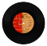
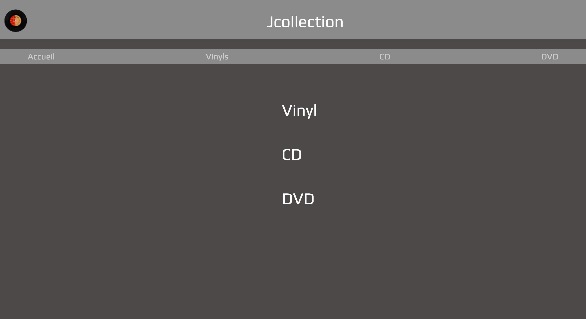

<div id="top"></div>

<!-- PROJECT LOGO -->
<br />
<div align="center">
   <h1> J Collection <h1>
    
 
</div>

<!-- TABLE OF CONTENTS -->
<details>
  <summary>Table of Contents</summary>
  <ol>
    <li>
      <a href="#about-the-project">About The Project</a>
      <ul>
        <li><a href="#built-with">Built With</a></li>
      </ul>
    </li>
    <li>
      <a href="#getting-started">Getting Started</a>
      <ul>
        <li><a href="#prerequisites">Prerequisites</a></li>
        <li><a href="#installation">Installation</a></li>
      </ul>
    </li>
    <li><a href="#usage">Usage</a></li>
        <li><a href="#roadmap">Roadmap</a></li>
        <li><a href="#contact">Contact</a></li>
        <li><a href="#acknowledgments">Acknowledgments</a></li>

  </ol>
</details>

<!-- ABOUT THE PROJECT -->

## About The Project



<p align="right">(<a href="#top">back to top</a>)</p>

### Built With

- [Angular](https://angular.io/)
- [Bootstrap](https://getbootstrap.com)

<p align="right">(<a href="#top">back to top</a>)</p>

<!-- GETTING STARTED -->

## Getting Started

To get a local copy up and running follow these steps.

### Prerequisites

- npm
  ```sh
  npm install npm@latest -g
  ```

### Installation

1. Clone the repo
   ```sh
   git clone git@github.com:WildCodeSchool/P3-jaffrebook-front-javangular-2021.git
   ```
2. Install NPM packages
   ```sh
   npm install
   ```
3. Launch application on localhost

   ```sh
   ng s -o
   ```

<p align="right">(<a href="#top">back to top</a>)</p>

<!-- USAGE EXAMPLES -->

## Usage

JCollection is an app that allows you to keep track for your collections (Vinyl, CD and DVD). Check, add, modify & delete items as much as you want ;)  

<p align="right">(<a href="#top">back to top</a>)</p>

<!-- ROADMAP -->

## Roadmap for next features

- [ ] Collection display
- [ ] Item info
- [ ] Create & modify forms


<p align="right">(<a href="#top">back to top</a>)</p>

<!-- CONTACT -->

## Contact

Jade CLAIRICIA - [LinkedIn](https://www.linkedin.com/in/jade-clairicia1/) - [GitHub](https://github.com/Jadeec)<br>

<p align="right">(<a href="#top">back to top</a>)</p>

<!-- ACKNOWLEDGMENTS -->

## Acknowledgments

- [Angular Material](https://material.angular.io/)

<p align="right">(<a href="#top">back to top</a>)</p>

<!-- MARKDOWN LINKS & IMAGES -->

[product-screenshot]: src/assets/ressources/homepageScreenshot.png
